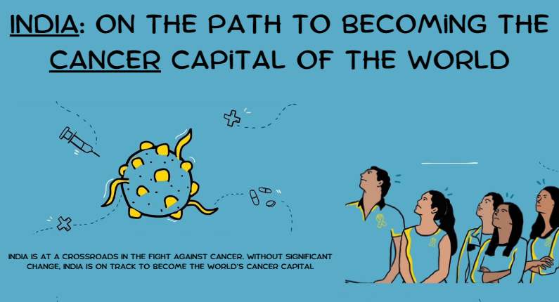
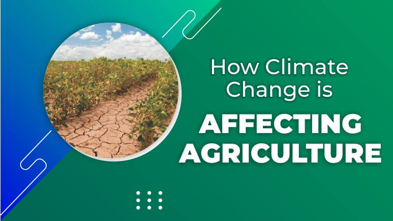

# Resume Overview: S. Vignesh

This README highlights the structure and key elements of the resume for **S. Vignesh**, a professional with expertise in business analytics, data visualization, and machine learning.

---

## **1. Professional Summary**
- Business Analyst and Data Analyst with hands-on experience in SQL, Python, Power BI, Tableau, and cloud platforms (Azure).
- Proficient in SDLC, Agile methodologies, and advanced data modeling techniques.
- Expertise in predictive analytics, data visualization, and machine learning.

---

## **2. Technical Skills**
### Methodologies:
- SDLC, Agile, Hybrid, Waterfall.

### Programming:
- Python (pandas, matplotlib, seaborn, numpy, tensorflow, pytorch).
- R (ggplot), SQL.

### Tools & Platforms:
- Power BI, Tableau, JIRA, SharePoint, SSRS, Azure.

### Databases:
- MS Access, SQL Server, PostgreSQL.

---

## **3. Education**
- **Bachelor of Technology in Computer Science** - DCE, India.
- **Masters in Business Analytics and AI** - OntarioTech University, Canada.

---

## **4. Professional Experience**
### **Nvest Solutions (Sep 2022 – Sep 2023)**
- **Position**: Business Analyst
- **Key Achievements**:
  - Created interactive Power BI dashboards for actionable insights.
  - Automated workflows using SQL and SSIS, optimizing business processes.
  - Provided expertise in Azure cloud architecture.

### **Web-Tech Pvt Ltd (Aug 2021 – Sep 2022)**
- **Position**: Junior Data Analyst
- **Key Achievements**:
  - Developed Power BI and Tableau dashboards for stakeholder presentations.
  - Automated data processing with Python and SQL, improving efficiency.
  - Contributed to strategic decisions using risk analysis and data modeling.

---

## Projects

### [Optimizing Investment Outcomes](https://github.com/vickythatguy/strategiesVsMutualFund)

- Developed and compared **nine technical trading strategies** using Python, achieving a **cumulative return of 624.28%**.
  
- Utilized metrics such as **Sharpe ratio** and **win rate** to evaluate performance.
  
- Conducted **data analysis and backtesting** for trading strategies including EMA, VWMA, MACD, and more.
  
- Compared strategy performance against the **TD Bank NASDAQ Index Mutual Fund** to provide actionable insights for investors.

---

### [Diabetes Prediction Using R](https://github.com/vickythatguy/diabetespredicition)

- Built **predictive models** using **Logistic Regression (97% accuracy)** and **Random Forest (98% accuracy)** for diabetes prediction.
  
- Conducted **Exploratory Data Analysis (EDA)** to identify key predictors such as BMI, HbA1c levels, and blood glucose.

- Implemented **manual oversampling techniques** for balancing the dataset and improving model performance.

- Generated insights to assist healthcare strategies for early detection and risk assessment.

---

### How It Works
- Click on the project title or the image to visit the GitHub repository for the full code, data, and implementation details.

---

## Data Visualization Assignments

### [Assignment 1: Mind Matters - Addressing Mental Health Challenges Among Seniors](https://vickythatguy.github.io/svignesh.github.io/assignment1)

This project highlights the mental health challenges faced by seniors, including depression, anxiety, and social isolation. Using data from **Statistics Canada** and the **World Health Organization (WHO)**, interactive visualizations were created to illustrate key trends and gaps in senior mental health care. Key tools used include **Power BI**, **Miro**, and **Prezi** for collaboration and visualization.

- **Objective**: Raise awareness of mental health challenges in seniors and propose actionable healthcare improvements.
- **Key Highlights**:
  - Explored data trends on senior isolation and depression.
  - Developed interactive dashboards for storytelling.
  - Proposed policy recommendations for better care.

[View Full Project](https://vickythatguy.github.io/svignesh.github.io/assignment1)

---

### [Assignment 2: Redesign a Notable Information Graphic - Nightingale's Coxcomb](https://vickythatguy.github.io/svignesh.github.io/assignment2)

This project reimagines Florence Nightingale's historic coxcomb diagram, demonstrating the power of data visualization in influencing public health. Using modern tools like R and Power BI, the project combines historical data with contemporary design principles to create interactive and engaging visualizations.

[View Full Project](https://vickythatguy.github.io/svignesh.github.io/assignment2)

---

### [Assignment 3: A Persuasive Infographic - India: On the Path to Becoming the Cancer Capital of the World](https://www.canva.com/design/DAGVjMPjbTs/Q266y7ICBx2YyUCvcAF6gg/view?utm_content=DAGVjMPjbTs&utm_campaign=designshare&utm_medium=link&utm_source=editor)

This project explores the alarming rise in cancer rates in India, highlighting critical factors such as lifestyle changes, environmental pollution, and healthcare accessibility. Through a persuasive infographic, the goal is to raise awareness and encourage actionable steps toward addressing this growing crisis.

[View Full Infographic](https://www.canva.com/design/DAGVjMPjbTs/Q266y7ICBx2YyUCvcAF6gg/view?utm_content=DAGVjMPjbTs&utm_campaign=designshare&utm_medium=link&utm_source=editor)

---

### [Assignment 4: Data Story - How is Climate Change Influencing Agricultural Productivity Across Canada?](assignment4.md)

The project examines how climate change impacts Canadian agriculture, highlighting challenges such as extreme weather and resource sustainability. It uses a scroll storytelling format to present data and engage audiences.

[Explore the Scroll Story](https://a-mbai5400thefamousfiv.vev.site/)

---

## **6. Certifications**
- Power BI Certification – Placeholder
- Tableau Desktop Specialist Certification – Placeholder
- Azure Data Fundamentals Certification – Placeholder
- Python for Data Science Certification – Placeholder
