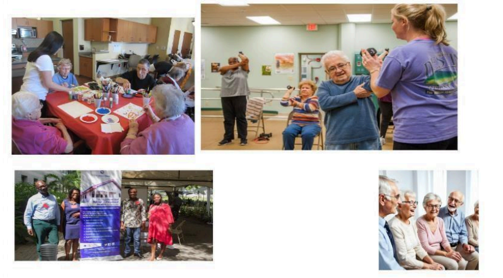

# Mind Matters: Addressing Mental Health Challenges Among Seniors

## Introduction:
For this project, I chose to focus on the mental health challenges faced by seniors, a topic that is often overlooked despite its significance. As people age, they are confronted with issues like depression, anxiety, and the isolating effects of living alone or losing loved ones. These emotional struggles are often compounded by physical decline and retirement, leaving many seniors feeling purposeless. While healthcare systems emphasize physical health, emotional well-being is frequently neglected, leading to silent mental health battles for many elderly individuals. This project aims to highlight these struggles and question whether current healthcare systems provide adequate support.

To convey this story effectively, I chose an interactive presentation format to engage the audience with a mix of visuals and data, making the complex topic of senior mental health accessible to everyone. Through this presentation, I used data from Statistics Canada, the World Health Organization (WHO), and the Canadian Coalition for Seniors' Mental Health (CCSMH). These sources provided the foundation for the graphs, which highlight the prevalence of depression, anxiety, and access to mental health services among seniors. The combination of narrative, interactive elements, and data visualizations ensures that the story is both compelling and informative, encouraging the audience to reflect on how we can better support the emotional well-being of seniors.

<a href="https://miro.com/welcomeonboard/Uk4ya0lhRjF5NU1JOXJwbnJ6VmVEMGNaOTY2MU9IejNwbHQ1eno1RU9uQ1YxUUpPOTJ0cXhlS3dTVnFMZUpXdXwzNDU4NzY0NjAxMzM0MDQ0Njc1fDI/?share_link_id=682473974319" style="color:blue; text-decoration:underline;">Miro Template for Reference</a>

---

## 1. Theme Iteration:
- **Initial Idea:** We began with a broad focus on mental health issues across various groups.
- **First Refinement:** The theme was narrowed to mental health issues in seniors, given the increasing attention on the aging population.
- **Final Decision:** The theme was further refined to focus on depression, social isolation, and access to mental health services for seniors. This choice addresses critical, often overlooked issues in senior care and highlights both emotional and systemic challenges.

---

## 2. Characters Iteration:
- **Initial Idea:** We considered a broad set of characters, including children, parents, seniors, healthcare providers, and others.
- **First Refinement:** We decided to concentrate on seniors as the primary characters, as they are the ones directly impacted by the theme.
- **Final Decision:** Alongside seniors, we introduced healthcare providers and policymakers as secondary characters, adding depth to the story by including perspectives from those who can influence mental healthcare systems.

---

## 3. Datasets and Metrics Iteration
- **Initial Idea:**
  - We considered a wide range of datasets, including general health information, social media trends, and global reports to understand senior mental health comprehensively.
- **First Refinement:**
  - We shifted our focus towards more targeted and reliable data sources, specifically from established organizations such as the World Health Organization (WHO), Stats Canada, and the 2021 Census.
- **Final Decision on Datasets:**
  - National Health and Aging Trends Study (NHATS)
  - AARP Loneliness Survey
- **Final Decision on Metrics:**
  - Prevalence rates of depression and anxiety among seniors
  - Percentage of seniors receiving mental health care
  - Social isolation metrics (self-reported loneliness)
  - Correlation between physical health and mental well-being

---

## 4. Visual Methods Iteration:
- **Initial Idea:** Initial plans included traditional visualizations like charts, graphs, and dashboards.
- **First Refinement:** We explored more engaging options, such as pictographs and infographics, that could resonate better with seniors.
- **Final Decision:** We opted for a combination of bar charts, line charts, and pictographs to make the data both informative and accessible, complemented by personal narratives or quotes to humanize the findings.

---

## 5. Delivery Format Iteration:
- **Initial Idea:** We explored various formats such as videos, articles, and posters to convey our message.
- **First Refinement:** To ensure accessibility for seniors, we shifted our focus toward simpler, more straightforward formats that are easy to understand and engage with.
- **Final Decision:** We opted for a Power BI dashboard to create an interactive and visually appealing data presentation, complemented by a simple infographic. Additionally, a print version will be available for seniors who prefer traditional formats.

---

## Storyboard Foundation (2nd Iteration):
1.   
   _Note: As we age, we all envision a life filled with joy, connection, and health. This slide shows a group of seniors enjoying outdoor activities, symbolizing what we hope the aging process will look like._

2.   
   _Note: Meet Charlie. After retiring, his life took a different turn. With his children and grandchildren living far away, Charlie moved into a nursing home where he now faces long days of isolation._

3.   
   _Note: Over time, Charlie’s isolation began to take a toll on his mental health. Like many seniors in similar situations, Charlie experienced depression and anxiety, struggling to find the emotional support he needed._

4.   
   _Note: The emotional toll isn’t just internal. Research shows that seniors like Charlie who suffer from mental health issues are more likely to experience physical health decline, further reducing their life expectancy._

5.   
   _Note: Despite the growing need, access to mental health services remains limited for seniors like Charlie. Many seniors go without the care they desperately need, leading to a worsening cycle of health decline._

6.   
   _Note: By addressing mental health issues and providing the necessary support, seniors like Charlie can live healthier, happier lives. It's time to prioritize the mental well-being of our elderly population._

---

## Delivery Format: Presentation (3rd Iteration)
The delivery format for this data story is a presentation. This format was chosen for its ability to combine visuals, text, and data in a clear, accessible way. The presentation format allows for a linear narrative, guiding the audience through Charlie's journey and the broader issue of senior mental health step by step. Using images, relatable characters, and data visualizations, the story will create an emotional and informative experience for the audience.

<a href="https://prezi.com/view/HlpTA2mehg4H1OPGTflV/" style="color:blue; text-decoration:underline;"><strong>View Full Presentation on Prezi</strong></a>  
<a href="https://drive.google.com/file/d/1OUfHiCD_f4ynRPfTylbQnJMZworjkSnZ/view?usp=sharing" style="color:blue; text-decoration:underline;"><strong>Download the PDF Version</strong></a>
---

## Conclusion:
The mental health struggles faced by seniors, like Charlie, are often overlooked, despite their profound impact on quality of life and physical well-being. Through this data story, we’ve seen how isolation, depression, and anxiety can severely affect seniors, reducing life expectancy and exacerbating health issues. At the same time, we've highlighted the pressing need for more accessible mental health services for this vulnerable population.

_Resources:_  
1. [COVID-19 and Social Isolation Among Seniors](https://www.canada.ca/content/dam/canada/employment-social-development/corporate/seniors/forum/covid-19-social-isolation/covid-19-social-isolation-en.pdf)  
2. [Social Isolation of Seniors - 2019 Report](https://www150.statcan.gc.ca/n1/pub/75-006-x/2019001/article/00003-eng.htm)  
3. [CCSMH: Clinical Guidelines on Social Isolation](https://ccsmh.ca/areas-of-focus/social-isolation-and-loneliness/clinical-guidelines/)  
4. [A Look at Loneliness Among Seniors](https://www.statcan.gc.ca/o1/en/plus/4881-look-loneliness-among-seniors)  
5. [The Daily - Loneliness Among Seniors, July 2022](https://www150.statcan.gc.ca/n1/daily-quotidien/220713/dq220713a-eng.htm)  
6. [Graph on Seniors' Loneliness, July 2022](https://www150.statcan.gc.ca/n1/daily-quotidien/220713/g-a002-eng.htm)

---
<a href="https://drive.google.com/file/d/1OUfHiCD_f4ynRPfTylbQnJMZworjkSnZ/view?usp=sharing" style="color:blue; text-decoration:underline;"><strong>Download the PDF</strong></a>
