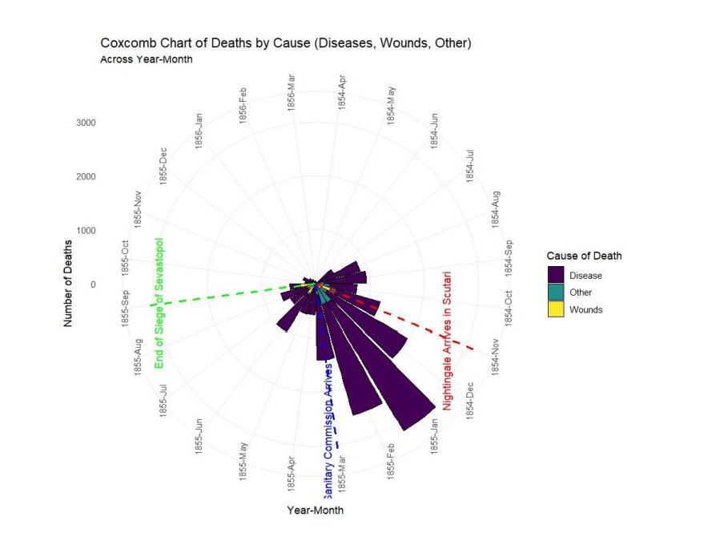
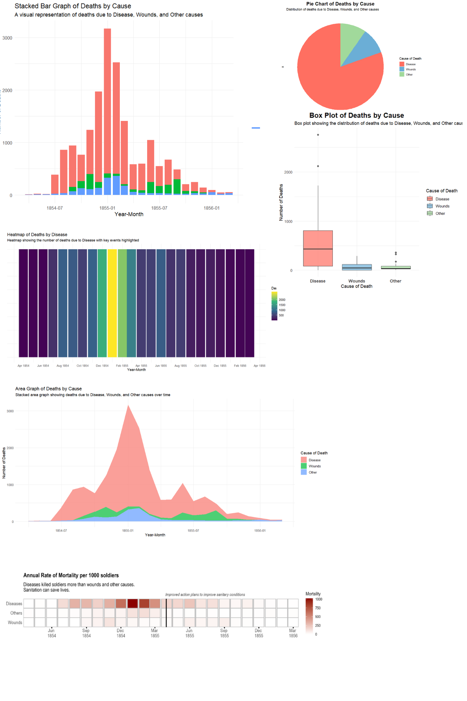

# Assignment 2: The Impact of Data Visualization - How Visual Storytelling Saves Lives

## Overview
In this assignment, I explore how data visualization can profoundly impact people's lives, using Florence Nightingale's work during the Crimean War as an example. The goal is to convey the importance of effective visual communication to an audience of students, particularly those studying medical and data sciences, and highlight how visualization techniques played a critical role in saving lives and improving healthcare outcomes.

---

## Iteration Process

### Iteration 1: Hand-drawn Sketches

The sketches represent the initial conceptual phase, where I explored different types of charts that could effectively convey the information from Nightingale's original visualizations. By considering various visual forms like bar charts, line graphs, and coxcomb-like diagrams, I evaluated the merits of each format for my target audience. The sketches helped me think about how different visualizations impact viewers' understanding and engagement with the data.

---

### Iteration 2: R Code Implementation

I used R to create various visualizations, including stacked bar graphs, heatmaps, and pie charts, to represent the number of deaths due to disease, wounds, and other causes. The dataset was sourced from the `HistData` package and the `nightingale` library.  
[View R Code](https://drive.google.com/file/d/1fy3rmqZTt_2nv1OxDG2jlnmHbdjcP6i4/view?usp=sharing)

These visualizations refined the visual storytelling aspect by experimenting with how different colors, shapes, and structures could communicate the story behind the data more effectively.

---

### Iteration 3: Infographic Created in Power BI

The infographic created in Power BI combines insights from both the sketches and R-generated charts into a cohesive visual story. The use of modern tools like Power BI allowed me to add interactivity and clarity that static graphics might lack. By incorporating interactivity, I invited viewers to explore the data themselves, making the visualization both informative and engaging.  
[View Infographic PDF](https://drive.google.com/file/d/1TziKhHqkQk588XkR63aUhDiYvdYIhBqX/view?usp=sharing)  
[Explore Power BI Work](https://drive.google.com/file/d/1y_E7Lj136c9FRb_kl-lUeiqVp9OrcMFD/view?usp=sharing)

---

## Reflection on Visual Techniques and Persuasiveness

The visualizations created highlight how graphical structures alter the viewer's experience:
- **Stacked bar graphs** provide a clear overview.
- **Heatmaps** reveal trends over time.
- **Interactive Power BI dashboards** transform these visualizations into exploratory tools, allowing viewers to engage with the data personally.

### Key Questions Addressed:
- **Does it become more persuasive?**  
  Yes, by using creative and interactive visualizations, the data becomes more engaging and personal, allowing the audience to explore and interact with the story.

- **Does it shift from rhetorical to exploratory?**  
  Yes, interactive elements encourage exploration, inviting users to draw their own conclusions.

- **How do modern techniques alter visualization?**  
  Modern tools like Power BI add interactivity, making visualizations dynamic, educational, and immersive.

- **How do these compare to contemporary graphics?**  
  Modern dashboards bridge the gap between historical and contemporary storytelling, making data compelling for today's audience.

---

## Conclusion
Data visualization is about more than presenting numbers—it’s about crafting a narrative that resonates with viewers, making complex data accessible, and driving impactful decisions. This project demonstrates how static data can be transformed into dynamic and persuasive narratives, inspiring action and innovation.

---

## Resources
- [R Code Implementation](https://drive.google.com/file/d/1fy3rmqZTt_2nv1OxDG2jlnmHbdjcP6i4/view?usp=sharing)
- [Infographic PDF](https://drive.google.com/file/d/1TziKhHqkQk588XkR63aUhDiYvdYIhBqX/view?usp=sharing)
- [Power BI Interactive Work](https://drive.google.com/file/d/1y_E7Lj136c9FRb_kl-lUeiqVp9OrcMFD/view?usp=sharing)
