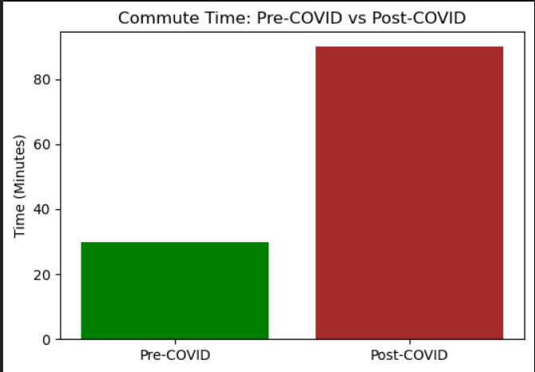
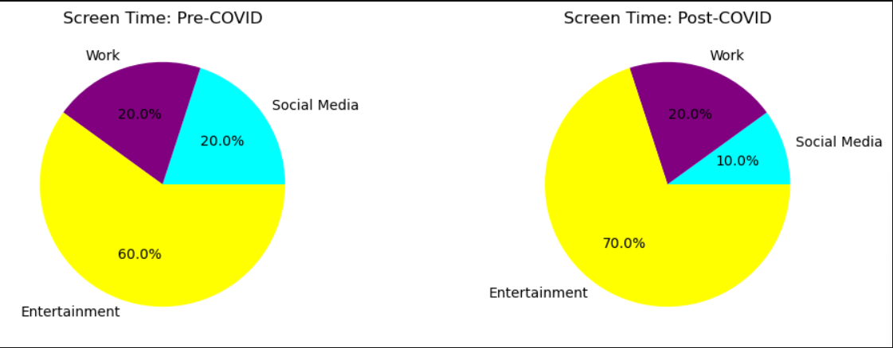
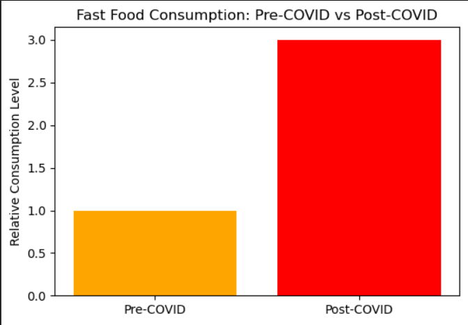
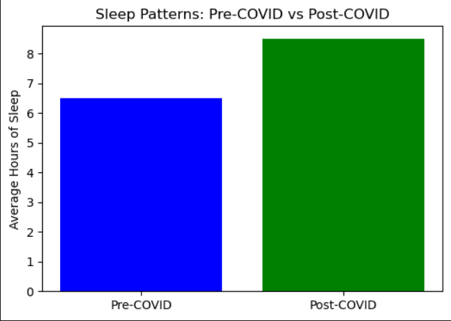

# Peer Profiles: Pre-COVID vs Post-COVID

This section provides a detailed analysis of **Aayushee Patel's** peer activity profile, comparing key behavioral changes before and after the COVID-19 pandemic. Each visualization illustrates shifts in habits, routines, and lifestyle factors, offering insights into the pandemic's impact.

---

## 1. Sleep Patterns
- **Pre-COVID**: Less than 7 hours of sleep.
- **Post-COVID**: Increased to more than 8 hours of sleep.

---

## 2. Physical Activity and Weight Changes
- **Pre-COVID**: Higher activity levels resulted in weight loss due to job responsibilities.
- **Post-COVID**: Reduced activity led to weight gain due to job loss.

---

## 3. Fast Food Consumption
- **Pre-COVID**: Minimal fast food consumption.
- **Post-COVID**: Increased fast food consumption.

---

## 4. Phone Screen Time
- **Pre-COVID**:
  - 20% Social Media
  - 20% Work
  - 60% Entertainment
- **Post-COVID**:
  - 10% Social Media
  - 20% Work
  - 70% Entertainment

---

## Python Code
The visualizations were generated using Python. You can find the full code implementation in the repository:  

[View Python Code](InclassTutorial.ipynb)

---

## Reflection
The visualizations highlight significant behavioral changes in **Aayushee Patel's** activity profile, offering insights into how the pandemic reshaped daily habits. These observations underscore the broader impacts of COVID-19 on lifestyle, health, and well-being.

---

[← Back to Portfolio](../README.md)
